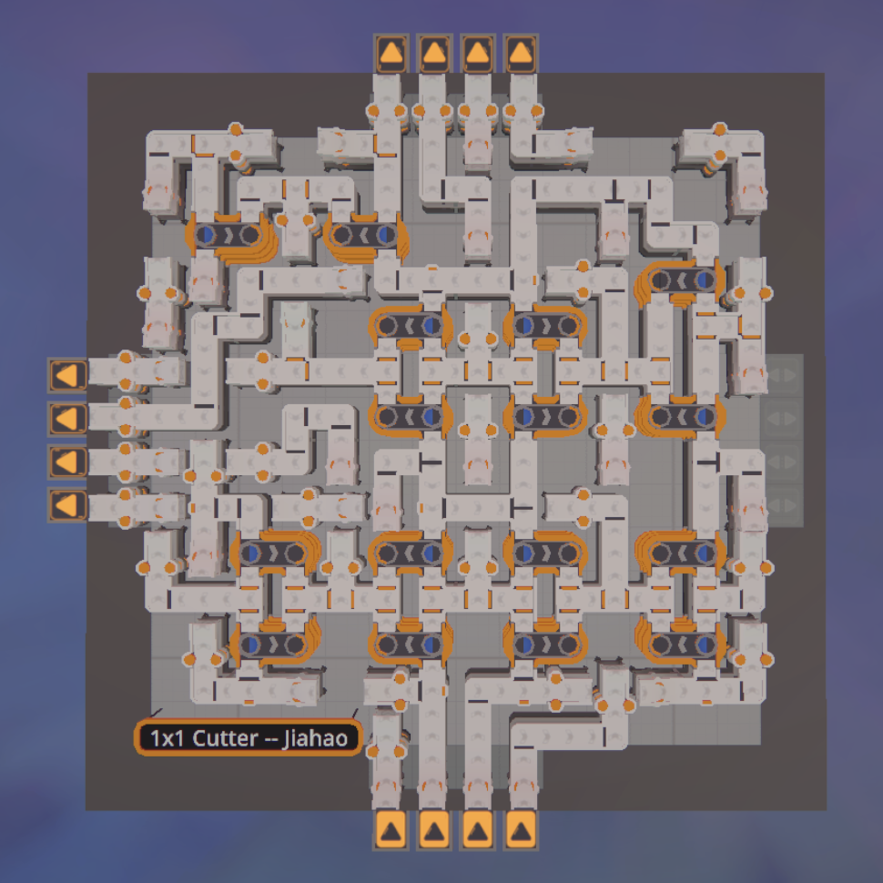

# Shapez2-MIP-Router

**Shapez2-MIP-Router** automatically computes optimal routing paths on a board, given a set of components and connection requirements.

It formulates the routing problem as a **Mixed Integer Linear Programming (MILP)** optimization, solved using a commercial-grade solver.

Below is an example output and implementation for 1x1 Cutter.
<p float="left">
  
  
</p>


## Dependencies

- **matplotlib**: 
  - For visualizing the board.
- **Gurobi Optimizer**: 
  - For solving the MILP.
  - Gurobi is commercial software but offers free licenses for academic users. See the [Gurobi Academic Program](https://www.gurobi.com/academia/academic-program-and-licenses/) for details.
  - At present, alternative open-source solvers (such as those accessed via the PULP library) are **not supported**. While technically feasible, porting to PULP is not prioritized due to its significantly slower performance, making it impractical for even moderately sized routing problems.


## Getting Started

1. **Install dependencies**:
   ```bash
   pip install matplotlib
   ```
   (Follow Gurobi's official installation and licensing instructions separately.)

2. **Clone the repository**:
   ```bash
   mkdir git
   cd git
   git clone https://github.com/jiahao-0204/Shapez2-MIP-Router.git
   ```

3. **Run an example**:
   ```bash
   python3 examples/1x1_rotator.py
   ```


## How to Customize

- **Adding new components**:
  - Navigate to the `components/` directory.
  - Copy and modify an existing component file.

- **Creating new routing problems**:
  - Refer to examples in the `examples/` directory.
  - Define boards, components, and connection requirements following a similar structure.


## TODO

- [ ] Add missing constraints:
  - [ ] Enforce: Jump by 2 blocks only if no jump by 4 blocks.
  - [ ] Prohibit simultaneous two-input and two-output at a node.
- [x] Add `examples/` folder with demonstrations
- [x] Expand available components:
  - [x] Rotator
  - [x] Halfer
  - [x] Splitter
  - [ ] Painter
- [ ] Add back component placer
- [ ] Add support for multi-layer routing
- [ ] Add stacker components


## How to Contribute

Contributions are highly welcome! You can help in several ways:

- **Report issues**:  
  If you encounter bugs, unexpected behavior, or have suggestions for improvements, please open an issue in the repository.

- **Create pull requests**:  
  If you have new components, new routing problems, optimizations, or new features, feel free to submit a pull request.  


## Notes

### Why Integer Linear Programming?

Traditional graph algorithms like A* and Dijkstra’s excel at **single-source, single-target** routing.  
However, for **multiple simultaneous routing demands**—especially when path sharing and complex options like launchers are involved—these methods struggle to scale efficiently.

After extensive evaluation, **Integer Linear Programming** proves ideal for:
- Handling multiple source-target pairs simultaneously
- Enforcing complex routing rules cleanly
- Providing certificates of optimality


### Working Principle

For each node, binary variables (taking values 0 or 1) are defined to indicate whether an edge—either a belt or a jump pad in one of the four directions—is used.

To encode the constraint that allows multiple belts to overlap but prohibits overlap between belts and jump pads, the following Boolean variable is introduced:

```python
any_belt_used = OR(step_edge_N, step_edge_S, step_edge_E, step_edge_W)
```

This logical condition is then reformulated as a pair of inequalities:

```python
any_belt_used >= (step_edge_N + step_edge_S + step_edge_E + step_edge_W) / 4.0
any_belt_used <= (step_edge_N + step_edge_S + step_edge_E + step_edge_W)
```

These inequalities are passed to the solver using `model.addConst(...)`, resulting in:

```python
model.addConst(any_belt_used >= (step_edge_N + step_edge_S + step_edge_E + step_edge_W) / 4.0)
model.addConst(any_belt_used <= (step_edge_N + step_edge_S + step_edge_E + step_edge_W))
```

To enforce that a node can be occupied either by multiple belts or by a single jump pad—but not both—the following constraint is added:

```python
model.addConst(any_belt_used + jump_N + jump_S + jump_E + jump_W <= 1)
```

### Archive code
- Some development code has been archived, including experimental implementations of A* and Dijkstra’s algorithms, for those interested.


## License

This project is licensed under the MIT License — see the [LICENSE](./LICENSE) file for details.

Happy Routing!